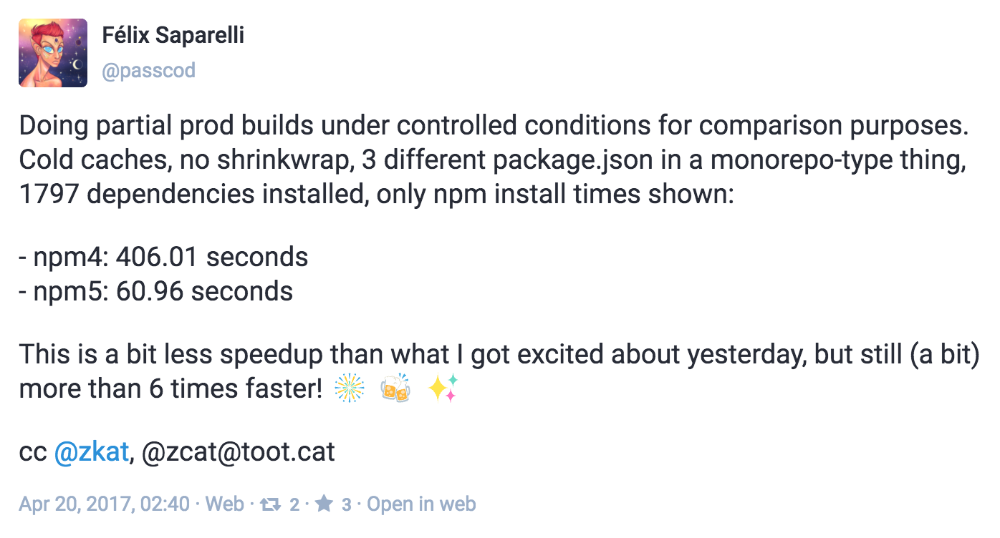
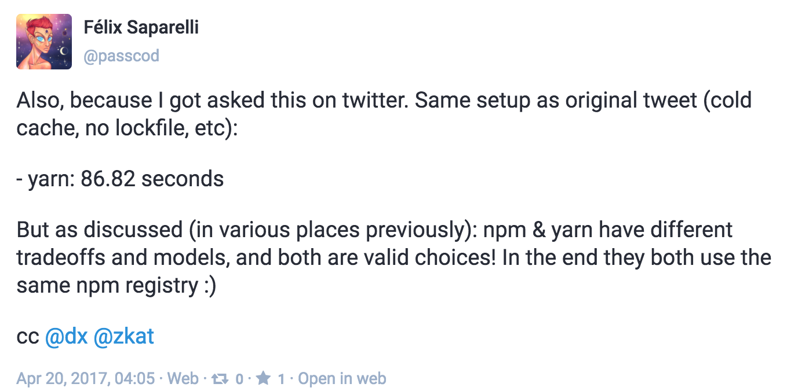
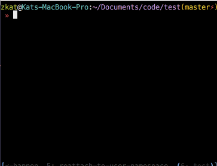
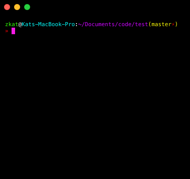

# [fit] npm@5

### [fit] Not just speed; but also speed

---

# get hype

^ Talk is gonna talk about npm@5. Mostly about the speed differences, but I wanna talk about a few other bits.

* It goes fast 🏃🏼‍♀️
* It's like a burrito 🌯
* It has cool features 😎
* We're not even done yet 💪🏼

---

# [fit] benchmarks: npm-website w/ shrinkwrap

^ Straight to the point: here's the summary of current benchmarks

Tool | Cold Cache | Warm Cache | Warm Cache + scripts
---|---|---|---
npm@4 | 98.894s | 144.191s 🤔 | 167.817s
npm@5 | 65.823s | 41.406s | 85.981s
yarn@0.22.0 | 41.73s | 30.41s | 73.87s

---

^ Brave volunteer tried out npm5 beta



---

^ This was really unexpected, and will not be the norm, but whoa



---

# [fit] 🔥566%🔥

### [fit] npm@5 vs npm@4

---

# [fit] 41%😽

### [fit] npm@5 vs yarn

---

# [fit] tl;dr

^ Heads up - get the timing right for switching the next few slides

---

# tl;dr

# [fit] npm@5 is

---

## tl;dr

# [fit] npm@5 is

## [fit] really

---

## tl;dr

## [fit] npm@5 is

# [fit] really @$%^ing

---

## tl;dr

## [fit] npm@5 is

# [fit] really #$%^ing

# [fit] fast 🏃🏿‍♀️ 🏃🏼‍♀️ 🏃🏽

---

^ But really, just look here. This is npm-website install. Left is npm5, right is npm4. (wait for npm5) It should tell you something that I probably shouldn't make you sit here and wait for npm@5 to finish. Let's move on.


---

# [fit] but why? 🤷🏽‍♀️

^ That's cool, but there's a reason, right? Did we break it?

---

# [fit] Intermission:
## [fit] Installation Steps

^ Since npm@3, we've had an installer that does entire tasks in individual phases. Let's look at those steps in the pipeline.

---

# Installer Phases

^ These is a 10k foot view of the steps the CLI takes. The %s are rough for the sake of illustrating scale and probably fairly wrong in practice, and will change a lot depending on many different conditions.

* read current `node_modules` (5%)[^1]
* fetch packuments (corgis!🐕) (10%)
* fetch tarballs (`pkg-1.2.3.tar.gz`) (20%)
* extract tarballs (30%)
* run scripts (30%)

[^1]: I literally just estimated these %s. Not precise.

---

# Installer Phases npm@5 improves

^ npm@5 only really affects three of these phases -- basically anything that deals directly with downloading stuff

* ~~read current `node_modules`~~ (5%)
* fetch packuments (corgis!🐕) (10%)
* fetch tarballs (`pkg-1.2.3.tar.gz`) (20%)
* extract tarballs (30%)
* ~~run scripts~~ (30%)

---

# Secret Sauce

^ npm@5 improved these steps with 3 fresh new projects

* cacache 💩💵 - *really* fast, reliable, secure **cache**
* make-fetch-happen 💁🏽👱🏼‍♀️- HTTP requests + cacache
* pacote 📦 - corgi🐕 and tarball fetch API

---

# cacache

* content-addressable
* robust/fault-tolerant
* safe, lockless concurrency
* 100% verified on insert _and_ extract
* _really_ fast
* caches corgis and tarballs to disk + memory

---

# make-fetch-happen

* get in loser, we're doing http 😎
* retries on failures
* streaming and/or bulk support
* standard http caching w/ cacache under the hood
* ^- means registry can control cache settings

---

# pacote

* "package" in Portuguese - "pah-COH-chay"
* puts it all together
* `pacote.manifest('foo@latest')` -> corgi
* `pacote.extract('foo@latest', './here')` -> tar data

---

# [fit] SHINY NEW FEATURES

^ But this is not just a story about speed. These projects helped add a bunch of new features to npm, and laid down essential groundwork for work we're going to do right after npm@5 comes out.

----

# [fit] Automatic Offline Mode

^ This mode means you no longer have to do anything special to get your install working when you don't have internet. It'll just happen, and it'll happen fast. npm@5 adds a few options for controlling how caching works, but cache-min and cache-max, if you're familiar with those, are deprecated.

---



---

# [fit] Automatic Corruption Recovery

^ This one's pretty huge. This is not something any existing JS package manager can pull off. Yarn, for example, can't detect whether its _cache contents_ are corrupted. So if a file goes missing or there's some disk error? You're outta luck. npm5, though, will seamlessly redownload bad data. It will *never* give you corrupted data.

---



---

# Other Features

^ There's a few other cool things available already:

* shasum in npm-shrinkwrap.json (+ fast cache fetches)
* semver support for git: `zkat/pacote#semver:^7`
* sha512 support (security! important!)
* streamed extraction (Unity needs this!)

---

# The Future: npm@5.1 - npm@6

^ As I said, npm@5 isn't the end of the story. We've got several more features and optimizations coming right after release:

* Isaac's `node-tar@3` makes `extract` 30% faster
* Parallel execution of `node-gyp` scripts
* New `node_modules` tree reader
* package.json/npm-shrinkwrap.json hashing
* Improved packument fetch phase (it's structurally throttled atm)
* shrinkwrap and `--save` by default
* local cache mirrors

---

# [fit] The future is even faster

---

# Thanx

Questions? Concerns? Incoherent Screaming?

## Get it now!

```
npm i -g npm5 \
  --registry=https://registry.internal.npmjs.com
```
