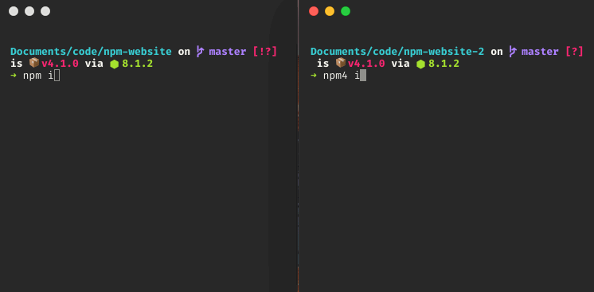
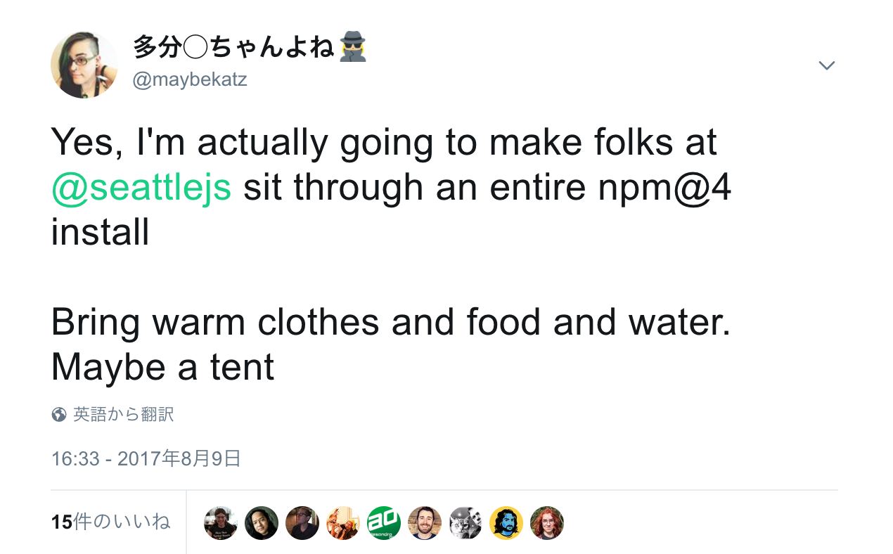
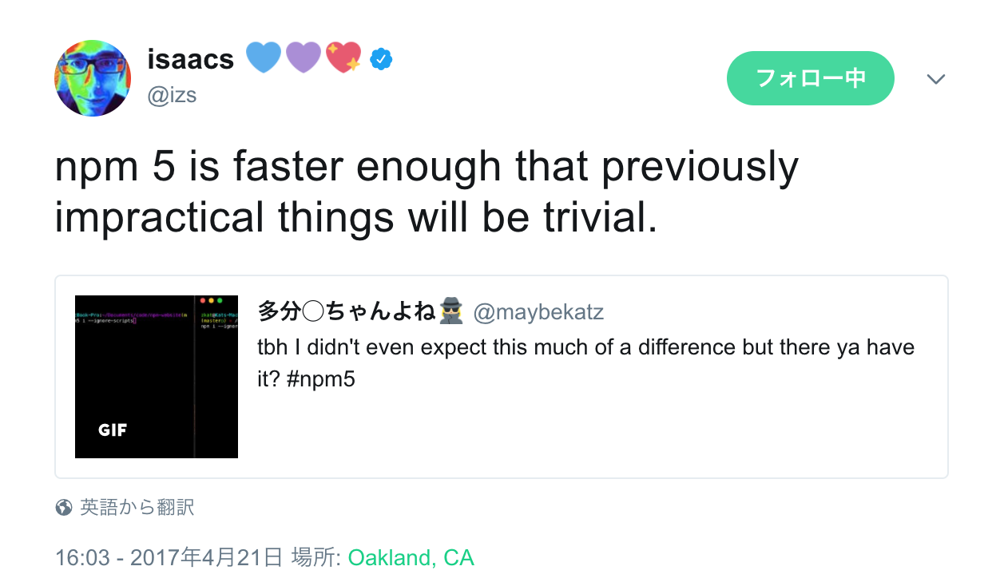
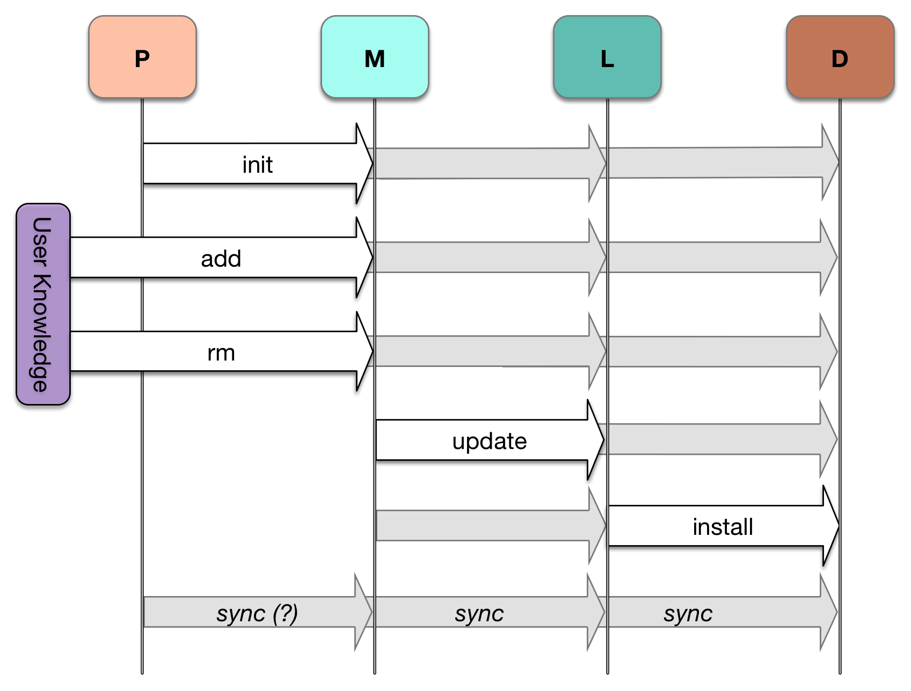
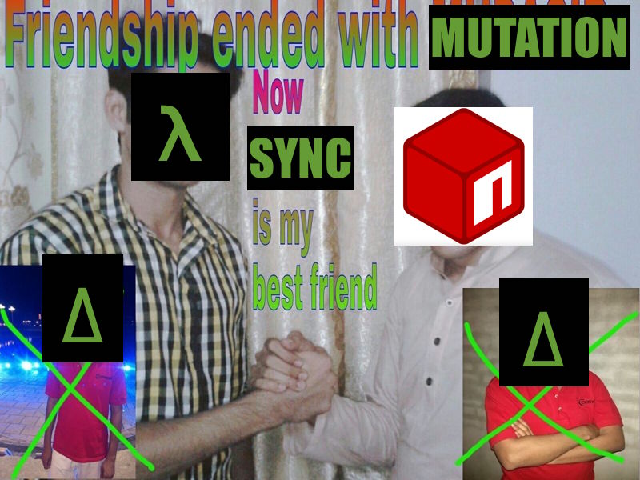
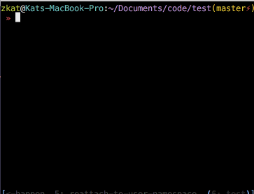
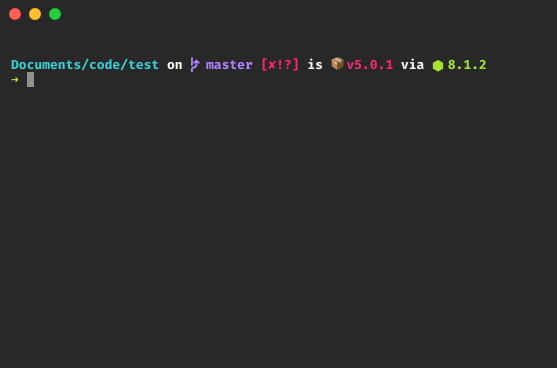

# [fit] npm@>=5

### [fit] JS Package Management For The Future

### Kat Marchán - SeattleJS Conf 2017

^ Hi! My name's Kat. I'm one of the two core devs on the npm CLI, and I'm here to talk about all the shiny new things in the latest version, npm@5. I'm also gonna talk about some of the stuff we're working on now, and what you can look forward to in the future. So hi! Let's get this show on the road, yeah?

---

# get hype

^ Ok so here's the general idea. It's fast, it's magical, it does cool things, it's easier to contribute to, and there's a looooot more in store. I know a lot of folks have been really excited about performance improvements, so let's do that one first...

* It goes fast 🏃🏼‍♀️
* It's like a burrito 🌯
* So many cool things 😎
* Much easier to contribute to 👯
* This isn't even my final form 💪🏼👽

---

# [fit] benchmark: npm-website

^ Here's some benchmarks. I ran these numbers last night using the latest npm releases for both versions. These tests were done on the repo for npm's website. I think this is a pretty representative test -- it hits a lot of the common cases that modern web apps seem to hit, such as installing a bunch devDependencies for building, like grunt and babel and such. It also has some git dependencies, which are more common to have in web apps, like when you're trying to use a fork of a project. It even has some dependencies in a private npmE registry, which tend to run a bit slower due to authentication. So yeah, it covers a lot of the bases so I like using it as a benchmark.

^ An order of magnitude is seriously nothing to scoff at. Literally everyone was surprised, specially the CLI team. We didn't think this sort of speed boost was possible. Would've done it sooner if we'd realize how much we could do.

Tool | Cold Cache | Warm Cache
---|---|---
npm@4 | 191.45s | 143.65s
npm@5 | 27.97s | 19.5s

---

# [fit] 🔥647%🔥

### [fit] npm@5 vs npm@4

^ Let's be clear here: This is a *647% difference* in performance, from a single semver-major release. It's unreal. I've benchmarked other projects where the difference will be anywhere from 5x to 10x. And that's with other people's web app setups -- a lot of our users were kind enough to just send me their package.json with private stuff stripped out, so I could test that their actual real-world thing was working.

^ !!!GIF WARNING!!!

---

^ Here's a side-by-side just to drive the point home, though. We can talk numbers all we want but ultimately, this is about your time, and your experience as a developer. This is an install on the npm website codebase. Left is npm5, right is npm4. And yeah. I'm gonna let it run.

^ Joke: "If I go over time, I can just blame npm for taking too long, right?"

^ Oh good, it's done...

---

^ That was fun, wasn't it? You could literally have gone on a bathroom break.

---

# [fit] tl;dr

^ Heads up - get the timing right for switching the next few slides. Read the @$%^ as "VERY".

---

# tl;dr

# [fit] npm@5 is

---

## tl;dr

# [fit] npm@5 is

## [fit] really

---

## tl;dr

## [fit] npm@5 is

# [fit] really @$%^ing

^ "VERY", not "FUCKING", please

---

## tl;dr

## [fit] npm@5 is

# [fit] really #$%^ing

# [fit] fast 🏃🏿‍♀️ 🏃🏼‍♀️ 🏃🏽

---

^ This tweet by Isaac pretty much tells it like it is. Think about all the people that have been running npm@3 and npm@4 for a couple of years now. Think about the folks still running it. Just imagine how much time this is going to save the 8.5 million active npm users we estimate we have.

---

# [fit] but how? 🤷🏽‍♀️

^ That's cool, but there's a reason, right? Did we break it?

---

# Secret Sauce

^ The secret sauce that got npm5 to where it is is a mixture of three new open source projects, a continued re-evaluation of our architecture, and a fancy rebranding of the feature formerly-but-still-currently known as shrinkwrap. cacache, make-fetch-happen, and pacote are three standalone, external libraries that together amounted to a complete rewrite of npm's entire caching and downloading subsystem.

^ They're very fast, they're individually pretty well-tested, and most importantly, they can be used separately from npm to do non-trivial tasks. cacache is already being used for non-npm purposes by a few folks, for example, and the Bundler folks have started porting it to Ruby as part of their next-generation global cache, which is gonna be pretty awesome.

^ make-fetch-happen is literally the fetch API, augmented with a cache that's compliant with the HTTP caching standard -- that means you can expect it to play nicely with server-side caching settings, instead of doing its own bespoke thing. This is a very important part of npm's new offline mode, too.

^ and pacote is the highest level API of these -- it does exactly two things: it gives you a package manifest from a package specifier, that is, the package name and semver specifiers you type when you npm install something. And second, it extracts the package contents for a certain specifier into a target directory. That's pretty much all it does. It handles all the details of doing that under the hood. That means you can use pacote to do scripted package analysis and processing without having to launch a whole npm process. And it means you can write a package manager that handles all the different types of packages that npm handles, but do your own installation logic, your own script logic, our own UI -- and you'll still benefit from this shared code.

^ If you want to contribute to npm, these packages are probably one of the best ways to do so right now -- so please check them out! We'd love your help.

^ So then, the rest of the performance boost was some architecture work to streamline the way npm thinks about node_modules, and related to that, a new file called package-lock.json which allows us to take advantage of all of this for both reproducible builds, and an absurd performance boost. I'll talk about these last two in a minute, but first, I wanna talk about how those three packages I talked about fit in with our plans.

* cacache 💩💵 - *really* fast, reliable, secure **cache**
* make-fetch-happen 💁🏽👱🏼‍♀️- HTTP requests + cacache
* pacote 📦 - corgi🐕 and tarball fetch API
* more streamlined process for working with node_modules
* package-lock.json 🔒- pre-calculated node_modules trees

---

# modular npm

#### aka "just write your own damn package manager"

^ This splitting off of major functionality into smaller packages is part of a larger project the team's working on: Making npm itself be as modular as possible. We'll still have one main npm client, but we want that client to be no more than a very thin glue layer between lower-level libraries. If things work out ok, the ultimate ideal is for you to be able to cook up your own package manager tool that serves your own need, with only a weekend's worth of work, and still benefit from all the institutional knowledge that the CLI team and others have put into these libraries. More package managers is a good thing, I promise! The reality is that people have different needs, and trying to get a single tool to fulfill all of those needs leaves you with a tool that is a jack of all trades but a master of none.

^ I genuinely hope this work we're doing helps keep the ecosystem stimulated so we can keep reminding ourselves that we can keep doing better. We've been working closely with other package manager maintainers to figure things out, get new ideas, and generally coordinate our efforts so we can all best serve our individual communities.

---

^ Ok so let's take a moment to talk for a bit about package manager theory, or whatever you want to call it. I want to draw a distinction here between two types of approaches to package management: the difference between a mutation-based workflow, and a synchronization-based workflow.

# Sync vs Mutate
### A New Way to think
### about Package Management

---

^ This way to think about it is something npm has generally been moving towards, specially since npm@3, or even npm@2, but what really helped the idea gel and made it easier to target was this wonderful article by Sam Boyer -- one of the designers for Go's new package manager, called dep.

^ It's a fantastic overview of package management as a problem, the different solutions that have been tried, their individual limitations, and so on and so forth. That's mostly just good info to have if you want to understand this sort of stuff better, but the real juicy thing about this article was when he started talking about what a future package manager might look like. In npm terms, the team talks about the differences he lays out as "mutation" vs "syncing".

## "So You Wanna Write a Package Manager"[^2]

### by Sam Boyer (@sdboyer)

[^2]: https://goo.gl/yWNtXp

---

^ The first, mutation, is what we see older versions of npm doing, particularly before npm 3. What I mean by this is that the mental model for npm usage was that you have this `node_modules/` tree in your filesystem, and all you want is a tool to make it easier to manipulate its contents in particular ways. I'm not gonna go into the nitty-gritty, but there's a lot of little tidbits about how npm works where you can spot this: the way linking works, the fact that it didn't save by default, the troubles caused when npm@3 introduced flattening. This way of doing things worked really well for npm in the past, when projects were small and most node developers were library authors figuring out how node.js was even supposed to work. Doing it this way meant that npm would need to adapt to changes you were making to node_modules/ manually. But everything changed when the fire nation attacked...

# mutation

### Procedural
#### "Put this in node_modules/"

---

^ And by fire nation, I mean y'all with literally-literally thousands of packages in your projects setting your machines literally-figuratively on fire. Web developers are by far our biggest demographic now, and we need to think differently about what a package management tool looks like at that scale. This is where sync comes in. Where mutation was procedural, syncing is declarative. It's functional. It sees your package.json as input to a black box program, and maps it to a final node_modules/, which it shapes however it wants. It also transforms it along the way. It works much like a functional pipeline in this sense.

# sync

### Declarative
#### "These are the deps. Give me a matching node_modules/."

---

^ The core idea behind what Sam described was separating a package manager into stages, starting from your source code, and you, the user, and ending up in a usable node_modules/ directory, with all information flowing exclusively in one direction. That means manual changes to later stages will be thrown away entirely if they don't match earlier stages.

^ Here in this chart, we have the four main ones, as well as the user -- the P refers to the package, or your source code. M stands for manifest, which is package.json. L is a lock file, which is package-lock.json. And D is dependencies, that is, node_modules.

^ So what we're seeing here is that `node_modules` is installed based on the lock file alone, the lock file is built based on the manifest alone, and the manifest is built by a combination of user inputs, or by other tools that will edit the package.json for you based on your source code. These steps don't skip rank: you need to reach one step before you can do the next one, at least _conceptually_.

---

^ So why make this change? Why not just let you do whatever you want to your lock file or to your node_modules without having to worry about earlier stages clobbering your changes?

^ (briefly go over reasons below)

## [fit] What's the point?

* smoother learning curve for users
* harder to paint yourself into a corner
* higher-level optimizations
* easier to specify behavior (for 3rd party tools!)
* more heavy lifting by npm

---

^ If I were going to explain this without talking so much, I'd say that sync is to mutation, for node_modules, what react is to jQuery, for the DOM. They both have their tradeoffs, and have different scaling profiles. By intentionally restricting what's possible, you can optimize for the most important parts that need to work, and get a more streamlined, easier to learn tool. The downside is you distance your users further away from what they're "actually doing" (use scare quotes), and you limit what they'll be able to easily do as a result. You can have escape hatches but they're going to be very very ugly, and very very discouraged.

# ELI25
#### `sync:mutation::react:jquery`

---

^ So yeah. npm is betting on the sync model being the direction it needs to move in, and npm@5 was a significant step in that direction. It's a bit of a bumpy ride at first while we transform a legacy system and figure things out, but I'm pretty confident that we're going to end up with something really fantastic here.

---

# [fit] SHINY NEW FEATURES

^ Not that what we already have isn't fantastic. Now that we've gone over the new ideas in npm, let's go over more concrete stuff! Features!

---

^ First is package-lock.json, which is our lock file, and part of our shiny new sync pipeline that I just talked about. This is our new lock file format. For those of you unfamiliar with them, they're an extra file that a package manager will write which represents the exact install tree that was generated based on the dependencies in a package.json. I'm not going to go into it in detail right now, but what you need to know is that npm will start writing this file whenever you install now, and you should commit it. And it'll make it so that your teammates, CI, and anyone else who clones your project gets the exact same install off the same commit. This can save you a bunch of headaches that would otherwise happen from one coworker accidentally pulling in a broken transitive dependency, and you end up in a "works on my machine" situation. With lock files, you can at least be sure that you have the same node_modules/, if you run into some weird bug.

^ The name's pretty new, but it turns out we had most of the work for this done already in the form of npm-shrinkwrap.json. We knew shrinkwrap needed an overhaul, and doing that was one of our main goals when we started planning npm@5 almost a year and a half ago. We were planning on keeping the name at first, but uh... certain things happened that made it very clear that people have no clue whatsoever what shrinkwrap means, but "lockfile" kinda magically clicks with them. And honestly? It's better to just use a term people actually grok. So now we have a package lock. Cheers, Yarn. :P

^ Anyway, it's not just changes in UX. We added some nice new features to it, such as sha512 support for all package tarballs referenced, so you know you're getting the exact same data byte-by-byte now. It's a lot easier to switch registries now, too. A lock file generated on one registry can be used pointed at any other registry, and it will fetch the tarballs from _that_ registry instead, automatically. It'll even make sure the file contents match the checksum.

^ Finally, we've thoroughly documented the package-lock format and put enough information into it that, we believe, any existing lock file formats can be generated from its data. This is a step towards inoperability, and we very much intend on package-lock.json becoming a standard that can be consumed by any other npm-compatible package manager, even if they have their own format that they generate. I already have a little tool to convert package-lock.json to pnpm's lock file format, and that helped immensely in figuring out what we actually needed to save. Cheers to the pnpm maintainers for being in touch with us so much!

^ Oh and by the way you should always commit it. Libraries, CLI tools, web apps, all of it.

# [fit] package-lock.json

* npm-shrinkwrap.json with a major UX overhaul
* sha512 support
* registry switching
* can be translated to other lock file formats
* COMMIT THIS FILE

---

^ Please note that the file is meant to be consumed by computers, not humans. That said, we've put effort into making it readable enough that you can understand individual patches to it to check that everything is ok with merges.

---

^ Next up is saving by default. By popular request, you can now stop forgetting to add --save to installs. I like this one a lot and we were talking about doing this for a long time. So. Here you go.

# [fit] --save by default

### `$ npm i pkg`
### adds `pkg` to `package.json`
### and `package-lock.json`

---

# [fit] Automatic Offline Mode

^ Another popular request, this mode means you no longer have to do anything special to get your install working when you don't have internet. It'll just happen, and it'll happen fast. npm@5 adds a few options for controlling how caching works, but cache-min and cache-max, if you're familiar with those, are deprecated. Seriously, you don't even need any flags. There's an `--offline` option now to force offline even when you have network access, or when your network is way too slow, but in general, npm will do the right thing for you when you open your laptop on a plane and run npm install.

^ !!!GIF WARNING!!!

---

^ Here it is in action...

---

# Other Features

^ There's a few other cool things available already:

* semver support for git: `zkat/pacote#semver:^7`
* sha512 support in downloads and package-lock.json (security!)
* automatic cache verification and corruption recovery

---

# ACTUALLY THERE'S ONE MORE

---

# NPX

### An npm package execution tool.

### Now bundled with npm.

^ I'm really really excited about npx right now, too, which is a brand new tool that we started bundling with npm recently. It's intended to make it a lot easier for you to run executable npm packages in a variety of common situations. It's a pretty general tool with a number of bells and whistles and immense possibility.

^ !!!GIF WARNING!!!

---

^ Look, you can use it to create a choo app without having done any previous installs!

---

^ I could seriously go on for a long time about all the things npx can do -- using local project binaries from the command like, single-run, temporarily binary tool installs, switching node versions through the node package on npm, or even downloading an executing a gist a VERY TRUSTED FRIEND OR LOVED ONE gave you.

^ If you wanna see more stuff you can do, check out the awesome-npx repo linked here, and maybe listen to the toolsday.io podcast that came out literally yesterday where we go a bit more in-depth with this tool.

^ Again, it comes with npm now, so you can start relying on it being there for users with newer npm5 versions, or you can install the standalone version with npm install -g npx.

# NPX DOES A LOT

* `$ npx grunt` - Use local binaries without `npm run`
* `$ npx create-choo-app` - temporary, one-off tool installs
* `$ npx -p node@7 npm t` - try your code w/ diff Nodes
* `$ npx <gist-url>` - share utility scripts w/ friends
* Lots more: github.com/js-n/awesome-npx && toolsday.io

---

# npm@6 and beyond

^ As I said, npm@5 isn't the end of the story. We've got several more features and optimizations coming right after release.

---

# road to npm@6

* 2FA support + other security!
* overhauled linking workflow!
* go even more fasterer than ever!
* work w/ Yarn folks to add Workspaces!
* auto-install deps based on `require()`/`import`
* release more utilities as external tools!

---

# cipm

## an *installer* for CI

^ No, it doesn't install a CI for you: it's a tiny package manager that uses an existing package-lock.json to do a very very fast installation when there's no node_modules/. It's missing a lot of npm's features but is 2-3x faster and very small and lightweight.

---

# npa

## a *frontend asset* manager

^ npa is another thing in the pipeline -- an asset manager that installs into a separate assets directory and does flat installs and has a couple of other bells and whistles meant to improve how you install your frontend-only libraries. You'd basically use this in a lot of the same situations as you would bower, except it's got the same semver and registry awareness as npm, meaning you can pre-build things on publish instead of having to commit the builds to your git repo, and it always installs flat trees because that tends to be better for frontend folks. It'll even use `package.json`!

---

# [fit] The future is even faster and shinier

^ So we've gone over the new ideas that influenced npm5, the new features that came with that, and I've given you a bit of a glimpse into one of the possible futures. It's gonna be an exciting couple of years while our community and tools start shifting. I'm really looking forward to seeing all the new things that are made possible by these changes. I am and always have been a toolsmith at heart, and that means that there's no better sign of success than having enabled other people to do bigger, more amazing things than they ever could.

---

^ Please go update your npm and give it a whirl! I hope it goes well. And if you're interested in these sorts of tools and more bleeding-edge updates, check out package.community. A bunch of us package manager maintainers for all sorts of different ecosystems have been putting our heads together lately and comparing notes. I think it's going to spark a lot of cool things in the future.

^ Thank you very much!

# Thanx

## Get it now!

### npm i -g npm@latest

### Also check out 📦 package.community