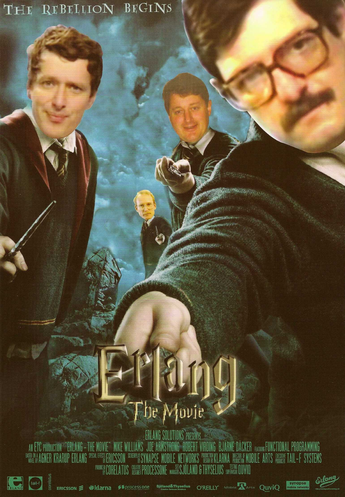
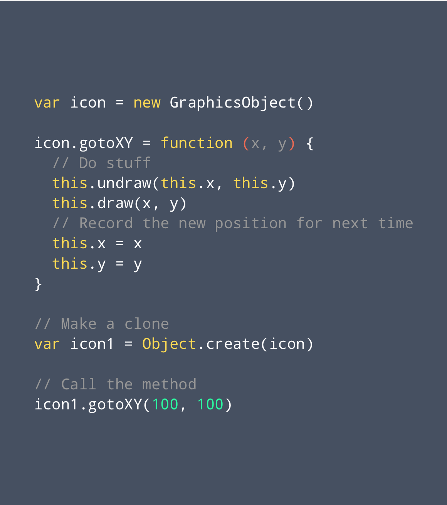
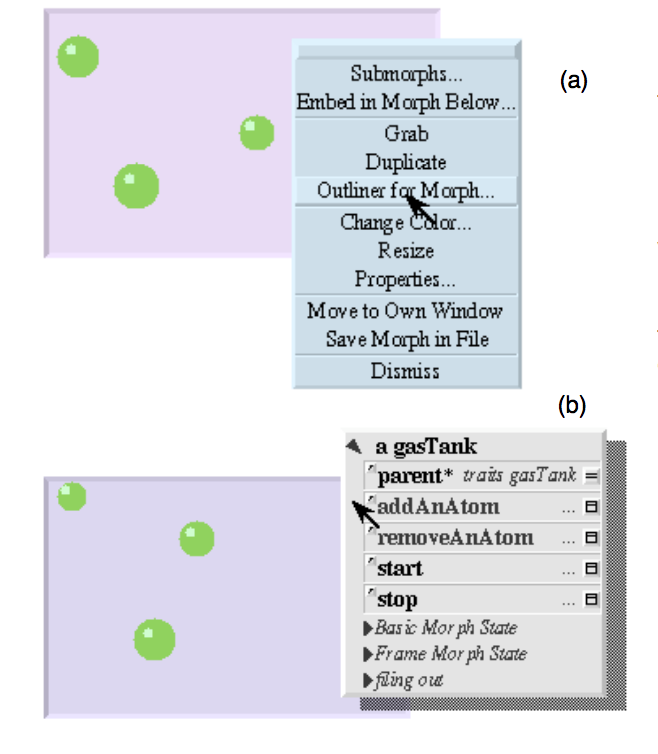
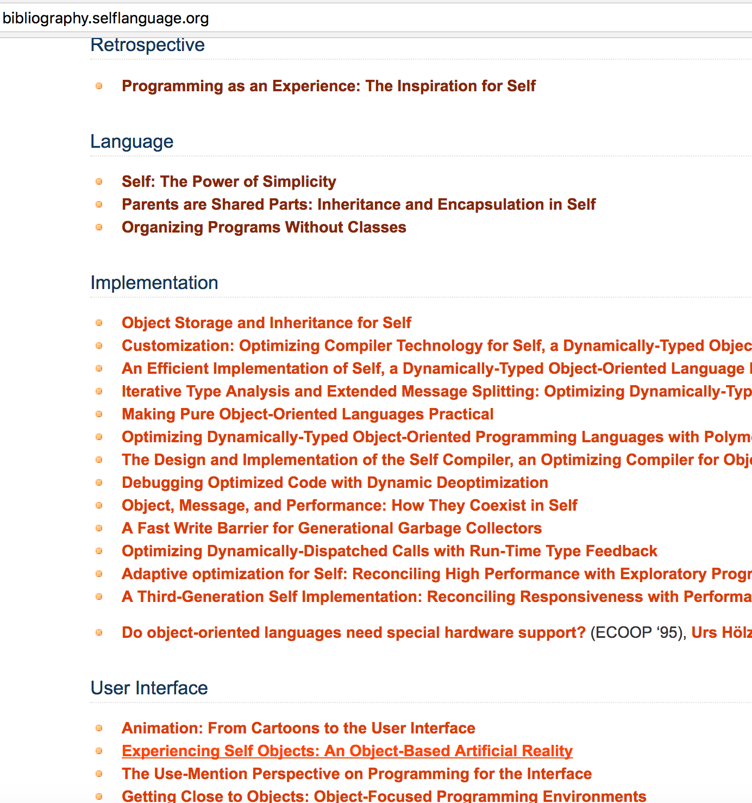
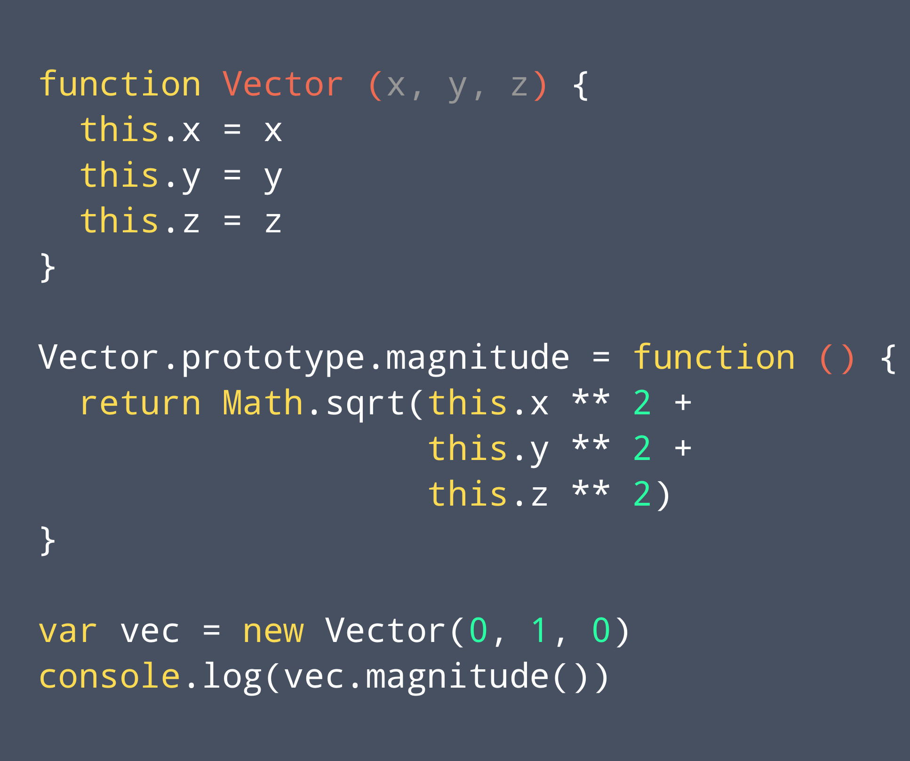
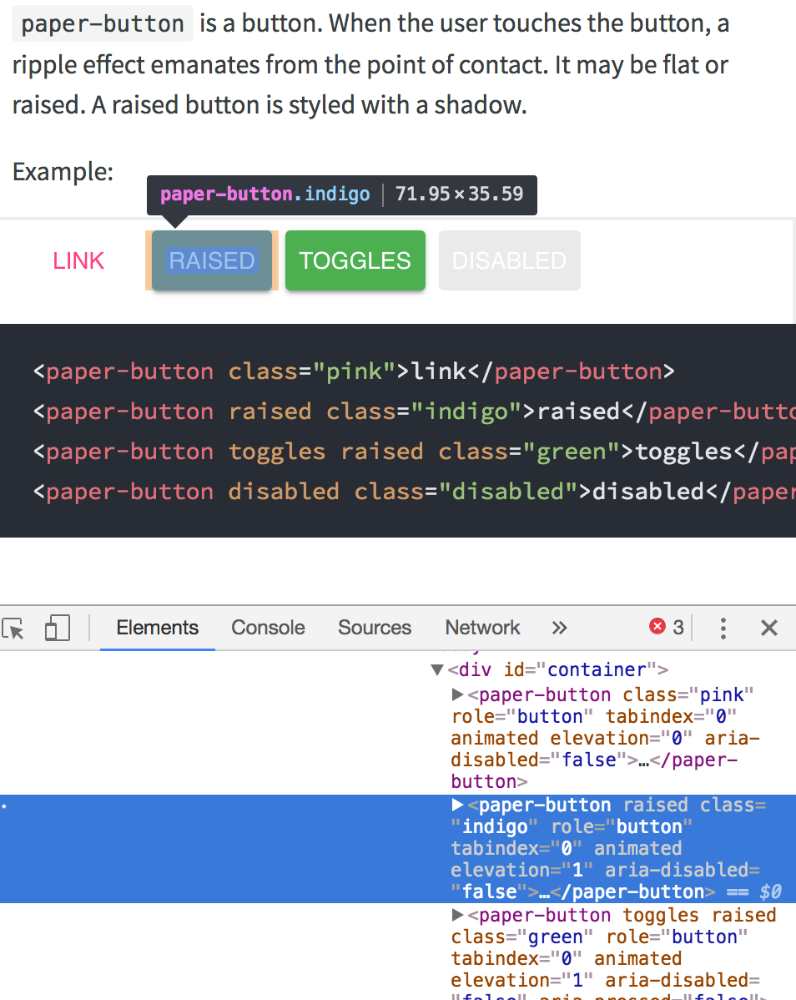
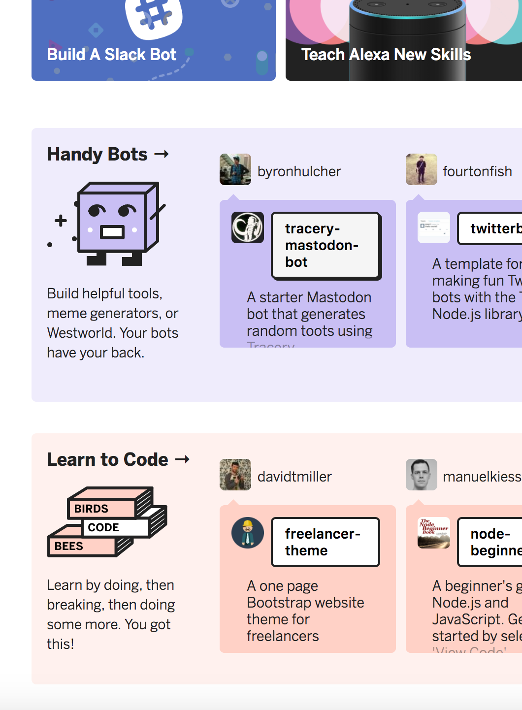
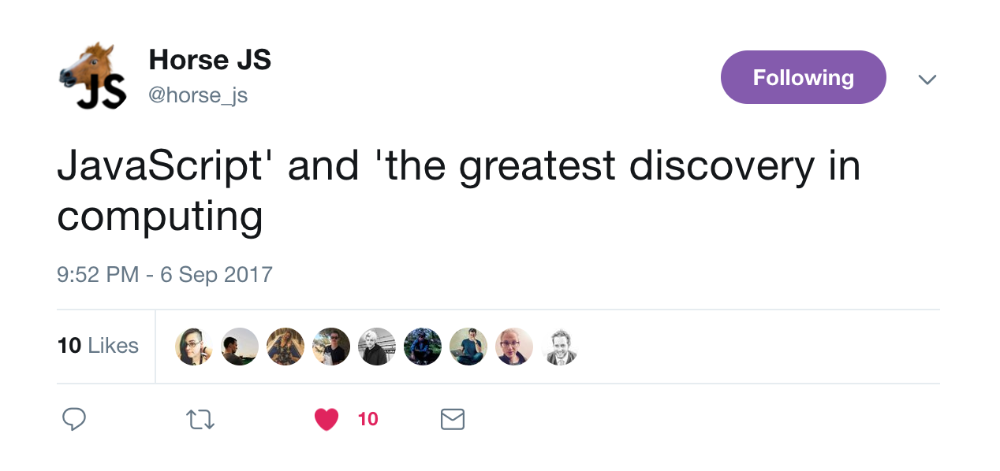

# A Brief History of **Prototypes**

#### [Kat Marchán 🐈 - **Empire**Conf 2017]

^ Hi! My name's Kat! I'm one of the devs for the npm CLI client. I'm also kind of a programming language theory nerd... and I'm here to give you a bit of a history lesson -- a lesson about one of the aspects of JavaScript that sets it apart from just about every other language being used at its scale: Prototype-based object-orientation.

---

## **Prototype**-based Object-Oriented **Pro**gramming

### (Prototype **OOP**)

#### ("**POOP**"? 💩)

^ Y'all are at a JavaScript conference, so I'm sure at least some of you have heard this term before. Others might be familiar with people talking about just "OOP", or "Object-Orientation".

^ But what *is* this whole prototype thing? Well, since there's probably more people used to class-based languages, I'll explain it in terms of that...

---

### Classes are **blueprints**

```ruby
class Dog
  def bark
    puts "Woof Woof!"
  end
end

class Pug < Dog
  # Override the bark method in the Dog class.
  def bark
    puts "Wheeze! Wheeze! Cough!"
  end
end

butch = Pug.new
butch.bark # prints: Wheeze! Wheeze! Cough!
```

^ Think of it this way: Classes are like blueprints. They define the structure and behavior of objects, and then you create a bunch of similar objects **based on that blueprint**, like in this Ruby code here for creating a dog with a bark method.

^ When you want to create a new kind of object, you must first create a new class, and then make a bunch of instances from that definition. But you always have to define that extra class.

---

### Prototypes are **exemplars**

```javascript
// The Prototypal Dog™
const dog = {
  name: 'a dog',
  bark () { console.log(this.name, 'goes Woof!') }
}

dog.bark() // prints: a dog goes Woof!

// "Clone" the dog
const dogen = Object.create(dog)

// "Specialize" only the name
dogen.name = 'Dogen'

// Reuse the `bark` method from the other dog
dogen.bark() // prints: Dogen goes Woof!

```

^ Prototypes are different. In prototype languages, you don't have any classes. You just make objects that could even work entirely on their own.

^ Here's an example of a dog. It's just called 'a dog' here, and it has a bark method. And hey, look, we can use that dog by itself!

^ And so if we want a more specialized kind of dog, we just clone our dog prototype, specialize only the things we need to be more specific about, and we start using it right away. This mechanism where clones are able to reuse their parent's code is called delegation in prototype languages. In this case, dogen is using the bark method from its parent, but its own local name property!

---

## JavaScript is a
## **prototype**-based language

^ Why am I talking about this? Because JavaScript is very much a prototype-based language. Anything we do with objects with JavaScript always goes back to the behavior of its prototypes.

---

### JavaScript has **no classes**

```javascript
// Good ol' constructor-based JS
function Dog (name) {
  this.name = name
}

// Change the prototype of the constructor!
Dog.prototype = dog

const charlie = new Dog('Charlie')
charlie.bark() // prints: 'Charlie goes Woof!'
```

^ And this bears repeating: JavaScript has no actual classes. All this stuff we use, like constructor functions, are just a little bit of sugar over the underlying prototypes. Here you can see I'm reusing the old `dog` prototype through a constructor function just by setting that function's `prototype` property.

---

### JavaScript has **no classes**

```javascript
// Shiny new class syntax!
class ClassyDog extends Dog {
  constructor (name) {
    this.name = name
  }
}

// ClassyDog has a full-fledged prototype!
ClassyDog.prototype.bark() // prints: 'a dog goes Woof!'

const butch = new ClassyDog('Butch')
butch.bark() // prints: 'Butch goes Woof!'

Object.create(ClassyDog.prototype) // This still works!
```

^ Even the new `class` syntax is just papering over prototypes, just to give folks something more familiar. But believe you me, you're always working with prototypes whether you notice them or not.

---

## Proto**types**
### are about **Interaction**
### are about **Flexibility**
### are about **Play** 🤹🏽‍♀️

^ Why does this distinction matter? Because prototypes have always been about about interaction, flexibility, and play. They've been about creating programming experiences where the way we interact with our programs feels more tangible and closer to objects in the real world. I know this might seem kinda abstract when I say it like that, but I hope as we go on, this ends up making a lot more sense to you.

---

### This talk is about **History**

^ But anyway, this talk isn't exactly about the mechanics of prototypes. This talk is about how this whole concept came to be. What ideas informed it. What we tried. What worked, what failed, what changed. It's about understanding **why** we did all of this.

---

### This talk is about **The Future**

^ This talk is also about the future -- because there's so much that our past can teach us about where we can go next.

---

## This **story** starts
## **40+** years ago.

^ And when it comes to prototypes, their story begins about 40 years ago...

^ TIMING: 3.5 min for intro

---

## **Director** (1976)

### Taking action on the **Actor Model**

^ ...with a little language called Director!

^ Now, I spent some time digging through papers and references for this talk, and as far as I could find, this is the earliest language that I'd say was recognizably prototype-based.

^ But it definitely didn't call itself that: it was trying to be an implementation of one of the hot new ideas at the time -- something called The Actor Model.

---


^ The actor model is this way of working with concurrent applications. The gist of it is you have these things called actors -- usually attached to some thread or process -- and you have them send messages to each other.

---


^ And then whoever gets a message responds to it however it wants. All it's got is a message.

---



^ You might've heard of the actor model before in terms of a language called Erlang, which has ended up being the standard bearer for the idea, even though it popped up much later.

---

## Director's **Lisp**-based "**Actors**"

* Early work in **Computer Graphics**
* **Message**-passing with `(ask ...)`
* **Optional** asynchronous event loop
* **Delegation**-based inheritance

^ And so going back to Director. The language was written as part of some early work on computer graphics.

^ As an implementation of the actor model, it used message-passing for its operations. There was an `ask` function you could call on objects to send messages to them.

^ These worked just like the methods you might be used to: actors would "respond" by just running the code for that message.

^ Director also had an async event loop that you could essentially schedule things into. It wasn't parallel. Really, it was a lot like JS's own event loop.

^ Finally, this is the first example I could find of delegation-based inheritance. In Director, you made new actors by cloning existing actors. When you sent a message to that new actor, it would try to answer the message itself. If it didn't have its own response, though, it would ask its parent to answer it instead, and then the next parent, until either finding a matching message handler, or failing.

^ This is a key feature here, 'cause delegation turns out to be one of the core principles of prototypes, and almost every prototype-based language since has used these semantics for its inheritance.

---

### Making a **Movie**

```lisp
(ask movie make my-first-film) ;; clone movie
(ask default-clock set your frames-per-second to 2)

;; animate star
(ask star plan next do at speed 25 move forward 100)
(ask star plan after 2 seconds grow 50)
(ask star plan after 4 seconds turn right 18)

;; animate pentagon
(ask pentagon plan next gradually grow 300)
(ask pentagon plan next do in 4 seconds move back 200)

(ask my-first-film film the next 4 seconds) ;; record scene
(ask my-first-film project) ;; play back scene

;; From the Director Guide, Kenneth Kahn (1978)
```

^ So what did Director look like? Here's some example code. Just like a lot of other language experiments of the day, it was written on top of Lisp.

^ So Director was designed for computer graphics. It used a style of graphics based on Logo's turtle programming, where you have this cursor called a "turtle", and you tell it in which directions to move and how far, and you end up with a drawing.

^ So, looking at the code... in the first line here, you can see the cloning I mentioned before: sending the `make` message to the `movie` actor created a new actor, and then assigned it to a variable called `my-first-film`.

^ From there, you can send different draw messages to different Actors representing graphics primitives. In this case, we had previously created a star and a pentagon, so that's what we're animating.

^ The `plan` message here was how Director would send work over to the event loop, to be executed asynchronously.

^ And then at the bottom, we tell our film to record the next 4 seconds, and then play back the scene it just recorded...

---

## Creates an **animation** and plays it back:


^ And I do mean play it back: this is a filmstrip of what you'd end up seeing on your monitor.

^ Anyway, that's Director. It would be a few more years before we stopped talking about actors when it came to semantics like these, and even longer until we started calling them prototypes.

^ TIMING: 3.5min

---

## Object**Lisp** (1985)

### Yes, Kat Likes Lisp **a Lot**

^ Which brings us 9 years later, to a language extension called ObjectLisp.

^ The was the first instance I could find of a prototype-based language that wasn't just trying to implement the actor model.

---

## (**Beep**) **(**boop**)**

* Used for **Lisp Machine** UI
* Called itself **Object-Oriented**
* More influenced by **Class**-based OOP


^ It was a language extension for Lisp used mainly in Lisp Machines by LMI. Lisp Machines were these big old computers with a special architecture that did a lot of Lisp operations directly on the metal. They were popular with some researchers and AI folks. They also had these operating systems that would let you manipulate running programs live, and even change the behavior of the OS, with some interactive Lisp scripting.

^ Lisp machines used ObjectLisp heavily for their UI work -- again, we see prototypes being a nice fit for interactively building graphical stuff.

^ Now, as far as I can tell, no one was calling anything "prototype-based OOP" at the time. ObjectLisp just called itself "Object-oriented". Heck, it emphasized this to contrast itself with classes. Probably a bit confusing for folks these days, where OO is almost synonymous with Classes.

---


^ So let's look at some code!

^ This is a little script written using ObjectLisp, to give you an idea of what it's like. Let's go over it real quick.

^ First, it defines an icon prototype, in that first line

^ Then, it adds a method called goto-xy to it with this `defobfun` operator

^ Going down a few lines, we see that it clones that icon prototype using `kindof`

^ And finally, it moves the clone to a certain X-Y coordinate on the screen by calling that method we defined.

^ Aside from the parenthesis, I think this code would probably not be too foreign to a lot of people here...

---




^ specially when you put it side-by-side with JavaScript.

^ Just putting these side-by-side, you can see how close the operations were to what we might be used to with JS.

^ Looking at stuff like this is a big part of why I really love to look into language history: We're -still- using pretty much identical semantics in 2017 to what some folks were already using in production more than 30 years ago.

^ To me, this slide here is incredibly validating about how solid the semantics we work with every day are: it means they've really held up to the test of time.

^ TIMING: 3min

---

## **Self** (1987)

### **Prototypes** all the way down 🐢

^ Speaking of 30 years ago, though. Hey, happy 30th, Self!

^ I'm sure some folks have heard of Self here. It's probably most famous for being the first fully prototype-based language. Heck, a lot of people just consider it the first prototype-OOP language, period. And to this day, this is probably one of the most important and innovative dynamic languages in the history of language theory.

---

## Programming as an **experience**

- Xerox **PARC** research
- **Smalltalk** with Prototypes
- Graphical interface to code
- more **tangible** objects
- Lots of UI/UX work



^ Self was a research language at Xerox PARC, which was basically the skunkworks R&D department of Xerox at the time. An incredible amount of cool stuff came out of there that we take for granted these days: Laser printers, bitmaps, the GUI, along with the mouse, ethernet for local networks, smalltalk, and the model-view-controller architecture, to name a few. It's kinda jaw dropping, to be honest.

^ So Self came out of this amazing place, as something that built on top of Smalltalk. Except instead of classes, it used Prototypes.

---

## Programming as an **experience**

- Xerox **PARC** research
- **Smalltalk** with Prototypes
- Graphical interface to code
- more **tangible** objects
- Lots of UI/UX work


^ Prototypes, it turns out, as we keep seeing, were particularly great at graphical work. Self doubled down on this a lot, making the entire development experience based around manual interaction with actual objects. You wanna have a new type of green ball? Just clone one of them and start hacking away.

^ There was no need to do the individual class definitions you'd have with Smalltalk, and the user experience of building applications by clicking on things was just so much smoother.

^ Just like smalltalk, Self had no source files. The way you wrote applications was by literally running a visual program and clicking around. All your code would then exist inside these visual elements. There was no building or text-based source control, or terminal work: you did the whole thing graphically.

---

## Prototypes, but **fast**

- Inline caches
- Hidden classes ("Maps")
- Adaptive Optimization
- Hide Complexity from User

^ And those graphics were a pretty heavy load in 1985. So, the Self dev ended up putting an immense mount of effort and research into making this prototype stuff go -very fast-.

^ Some of this optimization work had already been done with Smalltalk, like inline caches, but prototypes had special needs.

^ The whole point of this was to have their cake and eat it too: all the ease of use of a very dynamic system, but with speed to match lower-level languages.

^ And they really delivered on it! Many of the optimizations that Self pioneered ended up being used years later by JavaScript engines -- particularly V8.

---

## Language **Innovation**

- Inheritance
- **Slot** semantics
- Tons of published papers
- Xerox PARC is **cool**
- biggest **influence** on JS



^ Self also really explored the semantics of this concept of "prototypes". They played around with different types of inheritance, including multiple inheritance and traits. They played around with semantics for properties, and then took all of this stuff and published a bunch of papers on it so future generations could benefit.

^ Of any of the languages I'm gonna talk about today, I think it's safe to say that Self had the single biggest influence on modern JavaScript than any other, and I think there's still a lot of inspiration we can take from it.

^ TIMING: 3.5min

---

## Lambda**MOO** (1990)

### **Play** as Programming
### **Programming** as Play

^ Now for something a little different, maybe: instead of graphics, let's talk about a cute little language that used prototypes for really creative things in a text-based world.

---

## **M**UD: **O**bject-**O**riented

- text-based **MUD**
- founded at **Xerox PARC** (by Self folks)
- Online players **building** the world
- early Virtual world **research**


^ LambdaMOO was both the name of a programming language, as well as the game that used the language to build a fascinating little virtual world.

^ How many of y'all are familiar with MUDs here?

^ How many of y'all actually played them?

^ Okay so MUDs were basically the precursors to MMO games. They were online, they were multiplayer, and they were text-based. You would literally telnet in and you'd get this text adventure game that you could enjoy with others. The acronym stands for "Multi-User Dungeon".

^ So lambdamoo was one of these, and it was founded at Xerox PARC... by someone in their language research department. Three years after Self first came out.

^ The thing that really set LambdaMOO apart at the time was that it allowed the players themselves to make or modify objects inside the world. A player could log on, and start directly manipulating things without needing to be a GM or wizard or whatever.

---

```
$ telnet lambdamoo.local 8080
> connect wizard
*** Connected ***
The First Room
This is all there is right now.

> @dig n,north to "AcademyOfMedicine"                       <-- "dig" a brand new room to the north!
Nobelberget (#96) created.
Exit from The First Room (#62) to AcademyOfMedicine (#96)
via {"n", "north"} created with id #97.

> north                                               <-- move into the new room
AcademyOfMedicine
You see nothing special.

> @describe here as "The EmpireConf conference venue." <-- set its description
Description set.

> look                                                <-- behold the fruits of your labor!
AcademyOfMedicine
The EmpireConf venue.
```

^ Let me walk you really quick through a LambdaMOO building session. When you're reading this, the little angle bracket is the text input, and the stuff below it is the output from each command.

^ The first thing you do to play a MUD is connect to it. We'll use telnet in this case, for simplicity's sake.

^ Once we're connected, you'll see we're dropped into this First Room. There's not much else in the game because we haven't built it yet! So let's build something.

^ First thing is we dig out a room to the north with the @dig command. We'll call it AcademyOfMedicine. And that's it -- we've created a whole room now. That number is the unique object ID for that room object! Every object in LambdaMOO has an ID like that.

^ Then we type "north" to move into that room...

^ ...but it doesn't have a description, so we'll give it one with the @describe command.

^ And tada! Welcome to the EmpireConf MOO!

---

```
> @create $thing called audience                        <-- now create a regular object
You now have audience with object number #98                
and parent generic thing (#5).

> @describe audience as "A captive audience full        <-- and set its description
of excellent folks."
Description set.

> look audience                                         <-- let's take a gander, now
A captive audience full of excellent folks.

> @verb audience:entertain this                         <-- add a verb to audience
Verb added (1).

> @edit audience:entertain                              <-- drop into the editor
...(editor stuff)...
player:tell("The audience cheers for you! clap clap!"); <-- write the code and compile it!
...(compile and exit editor)...

> entertain audience
The audience cheers for you! clap clap!                 <-- Wow ilu all 😭💚
```

^ Let's move on to putting things inside the room that we can interact with, though.

^ @create makes a new object, here called audience. The $thing argument here is the prototype -- We're basing the audience on a generic $thing.

^ Again, we give it a description, just like with rooms, and take a look at it.

^ Finally, we use the @verb and @edit commands to add a new verb that will act on the audience

^ And that's it. That's what the experience of playing *and* programming LambdaMOO looked like. There's a full programming language, of course, with the usual bells and whistles, if you wanted to write more complicated logic, but if you just wanted to build some rooms and be creative? This was actually super accessible.

---

## "Lambda**MOO** is a new kind of **society**"
#### - LambdaMOO **Welcome** message
#### `$ telnet lambda.moo.mud.org 8888`

^ The thing is still running, by the way! It's been 27 years and there's still people playing this!

^ You can use this command -right now- to log in and start exploring, if you want.

^ TIMING: 4.3min

---

## **Lua** (1993)
### JavaScript for **C++** people 😏

^ So we're done with ancient history at this point. I've got two more languages to talk to you about, and they're both still in widespread use today. They're both from around the same time, and turned out to be pretty similar. The first is Lua, here.

---

### Custom software, **Fast** 🏃🏽‍♀️

- **Tecgraf** in Rio de Janeiro
- **Trade** Barriers -> **NIH** 👷🏾‍♀️🛠
- **Tcl** -> 😴
- Lisp **Semantics** -> 👍🏼
- Computer **Graphics** -> 🚀 + 📲

^ Lua isn't an acronym. It means "moon" in Portuguese, and it was created by members of something called the the Computer Graphics Technology Group (Tecgraf) at the Pontifical Catholic University of Rio de Janeiro.

^ See, the thing is that, at the time, there were a bunch of trade barriers for importing software to Brazil. So they either had to fork over all this money just to try and get things, or... they could write their own.

^ But writing your own versions of a lot of software is pretty rough. If you want to be able to prototype things really quickly, though, it turns out having a good dynamic language could help make that happen.

^ So they looked at TCL, but didn't Tickle their fancy

^ They really liked Lisp semantics,

^ ...but they hated the syntax. Shrug.

^ Finally, since this was going to be used for computer graphics software, it needed to be both fast and embeddable. That is, it needed to play nicely with the lower-level C and C++ code for the most performance-sensitive bits.

---


- **tables** (objects)
- **metatables** (inheritance)
- Actually quite **snappy**
- Popular in **Games** industry

^ So this is what we ended up with.

^ Lua called its objects tables, and it ended up doing inheritance through something called meta tables, which is really just a prototype chain thing.

^ It's really fast, too! Fast enough that it ended up getting widely adopted by most of the video games industry as the scripting language used for their game logic.

---




^ And by this point in time, we've seen prototype languages go back to something like the ObjectLisp semantics from years back. In fact, this Lua code that sets up a 3d Vector prototype maps almost directly to how you'd usually write it in JavaScript. The main difference being that setting up the metatables involves a bit more manual setup than JavaScript constructor functions. But just a bit.

^ As I mentioned before, Lua is still in wide use today. It's a cute, fun little language that really shines in the areas it was designed for. Much like the last language I'm gonna talk about here...

^ TIMING 2.5min

---

## **Java**Script (1995)
### Our beautiful **problematic** child 😭💚✨

^ The one this conference is all about! JavaScript!

^ At this point, we've covered about 20 years of history, and by now, JavaScript is about 20 years old. That's... kinda mind-blowing to me, actually.

^ So what is this Java Script thing, and what did we learn from it?

---

## Everyone's favorite **10-day** hack

- **Most widely-used** Prototype language 🌏
- **Web Platform** scripting 📜
- Easy to **learn** 👩🏼‍🏫
- Scheme👍🏼 + Self👍🏼 + **Java**'s Syntax🤷🏽‍♀️

^ Well, first of all, it's the most widely-used Prototype-based language in the world. And based on some statistics, there's now more code written in JS than any other language in history. That's a pretty big deal.

^ JS was created by Netscape as a scripting language for early web browsers. They literally just wanted to move pictures around a web page.

^ They did have some requirements for the language, though. JS was born right into the first Browser War, where different vendors were competing with each other pretty aggressively for market share, and any small edge in features could push you right past the competition.

^ There were two big constraints here: first, it needed to be easy to learn. Second, it needed to be written very very quickly. The first prototype was written in just 10 days, and it was basically a cobbled-together version of Scheme, Self, and because Java was the hot new thing back then, they just uhh... they kinda just slapped Java syntax on top of it and named it JavaScript to ride the wave of that language's popularity. That's pretty much it. That's how our beautiful problematic child was born.

---

## It's actually **pretty great**

- Prototypes are a great fit for the **DOM**
- Webdev is really **Fun**
- **Ecma**Script Standard and ES-Next

^ But even so? It's seriously great, and it's grown a lot since that 10-day prototype.

^ Prototypes turned out to be a great match for the DOM and the platform in general.

^ The goal of being easy to use worked out great, too -- JavaScript ended up ushering an entire generation of programmers into this exciting new webdev platform. That's a lot of your right here, probably. So many of us just learned to program by opening up an html file and playing around with things until they sorta kinda worked.

^ It's 2017 and to be honest, that part hasn't changed too much.

^ We also have an actual standard for the language now, and for the past few years, it's been evolving aggressively -- incorporating features of other languages and doing its best to keep up with the times. JS might be 20 years old, but it's most definitely a modern language in 2017.

^ TIMING: 2.5min

---

## **Re**cap

* **Director** (1976) - Prototypes, by Accident 👽
* **Object**Lisp (1985) - UIs and OSs and Lisp Machines 🎨
* **Self** (1987) - Super Interactive, Super Fast 😎🏃🏽‍♀️
* **Lambda**Moo (1990) - Prototypes as Play 🎮
* **Lua** (1993) - Why didn't browsers just use this? 🌜
* Java**Script** (1995) - Oh right, because of Java 🤷🏽‍♀️

^ So to recap real quick:

^ Director was the first language with prototype-like features and used for early graphics.

^ ObjectLisp came almost a decade later as a tool for UIs and an operation system made with secret alien technology.

^ Self took all these ideas, doubled down on it with a pure prototype language, and then optimized the everloving goodness out of it, then wrote a bunch of papers, and JS engines still use that tech today.

^ LambdaMOO was made by some self people, and it made it easy for an entire online community to craft a world and tell their stories together, without having to learn a lot about coding.

^ Lua is used a bunch by game devs, it's fast, and it's semantically very close to JavaScript. It's probably the second most popular prototype language.

^ and JavaScript is the thing this whole conference is about and you should go to other talks to learn more about it!

TIMING: 1min

---

## The **Future** of **JS**
### (based on the **past** 🕰)

^ So that's it. That's my little overview of how we got here.

^ Where do we go from here, though? How can we take all these history lessons and apply them to the modern world?

---

## Webpack **Less**
## Hack **More**

- More **Interactive** dev 📲
- Keep evolving **devtools** ⚒
- web **components** 💚



^ Well, for one, I think it's a great idea for us to go back to emphasizing interactive development. This is really where prototypes have always shined. As ES-Next starts making it into browsers, I hope the need for tools like Babel or Webpack starts disappearing, and we can focus more on interacting with the platform directly.

^ That also means continuing all the development going on with browsers' devtools. These are really great descendants to the development tooling that Self pioneered. With ES modules' new live binding exports, there's a whole world of interactive dev that we still haven't quite explored.

^ Finally, I think the work that's been going on with web components for the past few years is fantastic. Web Components are basically a way to clone and customize actual DOM elements, meaning you can play with your app right in the devtools html inspector. I think that's probably kinda controversial, but I totally think that, based on everything I've talked about, Web Components are the most natural evolution of the web platform. I think they're going to make the web a lot more accessible to new developers, and they're going to open doors we still can't quite imagine.

---

## Keep JS **Easy**

- The Power of **Simplicity** 👶🏽
- Web Platform as a little **OS** 👾
- Immediate results are **delightful** ☺️
- **Glitch**.com🎏 is fun



^ Kinda continuing down that path, it's really important to keep JavaScript easy. There's this Self paper titled "The Power of Simplicity" that really drives this point home. Simple, easy to learn languages help adoption, and it's up to us to help do everything we can without piling layers and layers of complexity over it.

^ The Web Platform is essentially a little operating system, after all, but with all these APIs expose that are, frankly, way easier to use than their native OS versions in a lot of cases. 

^ Also, let's keep doing this immediate results thing. Let's make it so you can nudge something around in your browser and see the changes right away. There was a talk yesterday about glitch.com, too. I love the things it's been doing to support this sort of thing. You should really check it out.


---

### The **Past** was pretty cool 😎
### And it defines the **Future** 😍

^ They say that those who don't learn history are doomed to repeat it. But I think when it comes to programming languages, repeating it is exactly what we want to do more: and how we figure out how we can go forward.

---



^ I'll leave you with this little note from our infamous horsy friend.

^ Thank you very much, and happy hacking!

^ TIMING: 2.5min conclusion
