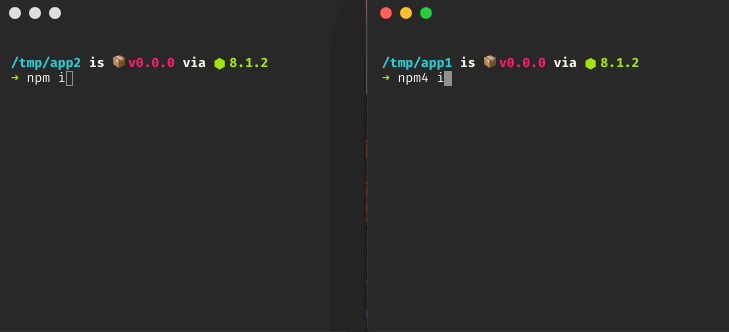
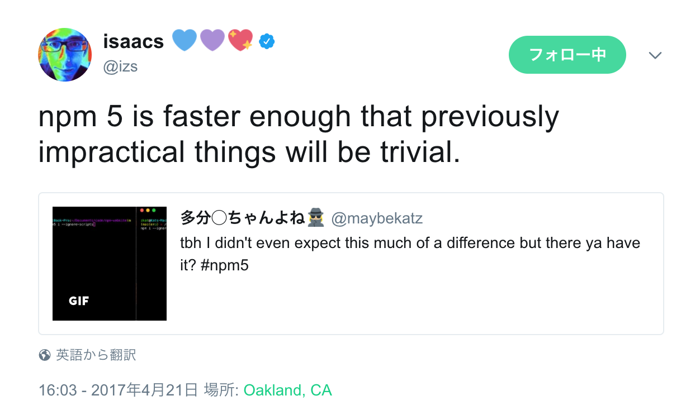
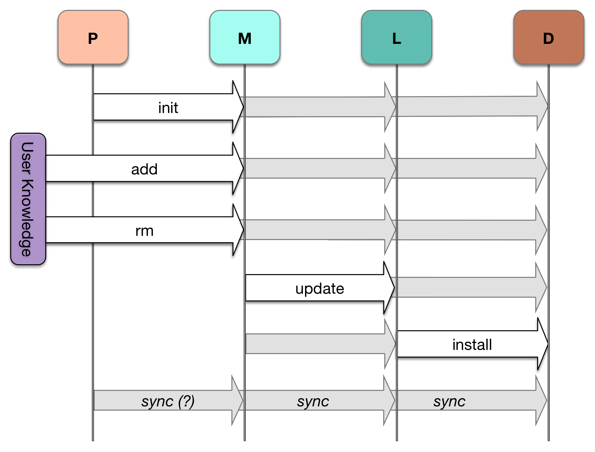
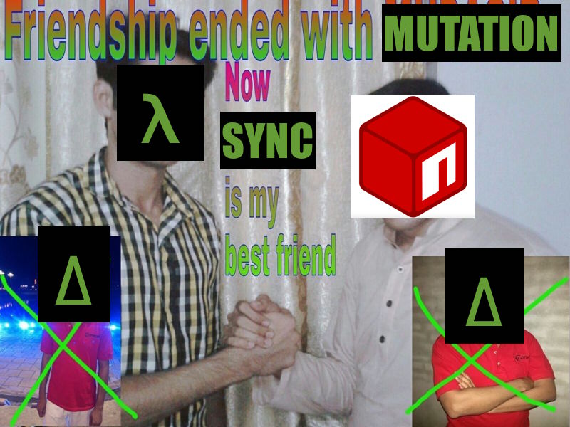
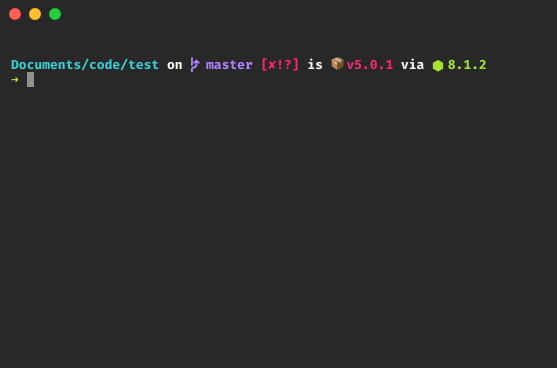
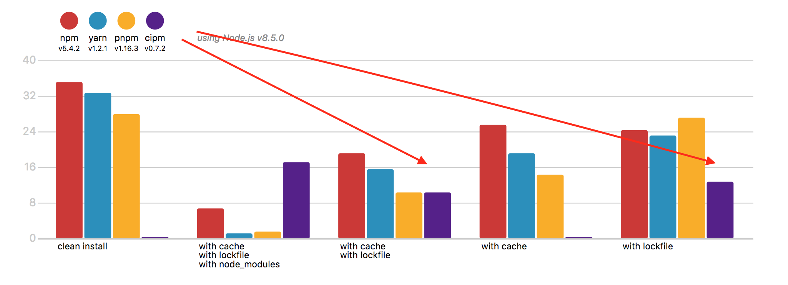

# [fit] npm@>=5

### [fit] El Gestionador de Paquetes del Futuro

### Kat Marchán - Nodeconf Argentina 2017

^ Hola! Mi nombre es Katerina Marchán, y soy una de las dos desarrollaras principales de npm, el gestionador de paquetes de JavaScript. Soy boricua de pura cepa, así que si hablo medio raro, es por eso.

^ Pues. Estoy aquí hoy para contarles algunas cositas nuevas en la versión más reciente, npm@5. También les voy a contar sobre las cosas que están ya de camino pronto, y sobre la dirección general que estamos tomando con la herramienta y el ecosistema. A ver, sí?

---

# El 5 es un número 🤔

^ Pues bien, estos son los temas para hoy. npm@5 es rápido, es un cambio fundamental a la forma que manejamos paquetes, hace un montón de cosas nuevas que tal vez ni sabes, hemos simplificado el código para que sea más fácil contribuir, y todavía tenemos varios planes para el futuro.

^ Sho sé que a mucha gente le interesa lo que pasó con la velocidad, así que vamos a empezar con eso...

* Sobredosis de mate 🍵🏃🏼‍♀️
* Se parece a un burrito 🌯
* Hace muchas cositas nuevas 😎
* Mucho más fácil contribuir 👯
* Aún más 💪🏼👽

---

# [fit] Prueba: npm-website

^ Pues aquí los puntos de referencia. Estos son números bastante recientes comparando una versión reciente de npm@5 con la última versión de npm@4. El website de npm es una aplicación de web bastante típica así que en mi opinión es un buen proyecto para ver cómo han mejorado las cosas. Tiene una variedad de devDependencies, transpilación, con cosas como grunt y babel. También tiene algunas dependencias de git, que son bastante comunes. Hasta tiene algunas dependencias en un repositorio privado de npm Enterprise, que tienden a functionar un poquito más lento porque hay que manejar autenticación.

^ Lo que ven aquí es una diferencia de un orden de magnitud. Esto no es ninguna tontería, y la verdad es que nos sorprendió bastante a nosotras que esto fuera posible. Hubiéramos hecho todo esto antes si lo supiéramos, porque *wow*.

Versión | Caché vacío | Caché populacho
---|---|---
npm@4 | 191.45s | 143.65s
npm@5 | 27.97s | 19.5s

---

# [fit] 🔥647%🔥

### [fit] npm@5 vs npm@4

^ Para estar claro: esto es una diferencia de velocidad de *647%*, de una versión de npm a la próxima. Es increíble. He probado una variedad de otros proyectos, muchos de ellos usando `package.json`s que han donado varios usuarios basados en sus propios proyectos reales, y siempre es entre 5 a 10 veces más rápido cuando uso npm@5.

^ ¡¡¡Una notita, que el próximo slide tiene un gif animado, por si alguien tiene problemas con movimiento en la pantalla!!!

---

^ Pues yo quiero enseñarles lo que es esta diferencia, en verdad. Puedo pararme aquí y gritar números el resto de la tarde, pero en fin, esto es sobre sus experiencias como desarrolladores. Esto que ven aquí es un `npm install` en ambas versiones de npm. 5 en la izquierda, npm4 en la derecha.

^ (cebar mate?)

^ Y sí, quiero que vean cómo se siente esto. Yo sé que hay mucho chiste con eso de que hacer npm install quiere decir que es hora de descanso, irse a pajarear con los colegas, etc.

^ Bueno, si se me pasa el tiempo por esto, puedo decir como excusa que npm se tomó demasiado tiempo, verdad?

^ Ay ya. Por fin.

---

# [fit] tl;dr

^ Heads up - get the timing right for switching the next few slides.

---

# tl;dr

# [fit] npm@5 es

---

## tl;dr

# [fit] npm@5 is

## [fit] muy

---

## tl;dr

## [fit] npm@5 is

# [fit] muy muy

---

## tl;dr

## [fit] npm@5 is

# [fit] muy muy

# [fit] rápido 🏃🏿‍♀️ 🏃🏼‍♀️ 🏃🏽

---

^ Este tweet de Isaac, el CEO de npm, es un buen resumen: imagínense las puertas que se abren cuando no tienes que esperar tanto para seguir con tu proyecto. Imagínense toda la gente que ha estado usando npm@3 y npm@4 por varios años. Y ahora imagínense que la cantidad de tiempo que esto les va a ahorras a las 8.5 millones de personas que usan npm.

---

# [fit] ¿Cuál es ese truco? 🤷🏽‍♀️🎶

^ Pues, cool, pero cómo hicimos todo esto? Qué fue lo que hizo toda esta diferencia?

---

# Es este truco 🎶

* cacache 💩👨🏻 - un **caché** revolucionario
* make-fetch-happen 💁🏽👱🏼‍♀️- HTTP + cacache
* pacote 📦 - corgi🐕 + `.tar.gz` con el API de `fetch`
* package-lock.json 🔒- `node_modules/` pre-calculado

^ ***** "cacache es el caché nuevo de npm. Porque el caché viejo era medio caca, ché."

^ El secreto de este cambio es una mezcla the tres librerías open source, una re-evaluación de la arquitectura del CLI, y un leve cambio de marca a algo que npm ya hacía pero que no era tan fácil de usar: los shrink-wraps.

^ Ya ayer tal vez vieron a ver a Jeff hablar de las librerías a las que me refiero: carache, make-fetch-happen, y pacote. Entre ellas reemplazaron el sistema entero de descarga, extracción, y cacheo de paquetes de npm, que ya estaba bastante viejito.

^ Estas librerías son todas bien rápidas, están bien probadas individualmente, y lo más importante es que se pueden usar separadas de npm para hacer cosas no-triviales.

---

# modular npm

### "escribe tu propio gestionado y déjame en paz"

^ Y esta división de npm en pedazos individuales es parte de un proyecto más grande que mi equipo tiene en proceso: Hacer que npm en sí sea lo más modular posible. Todavía tendremos un sólo cliente principal que se llamará npm, pero queremos que esa herramienta sea muy pequeña y simplemente esté compuesta de varias otras librerías que hacen todo el trabajo de verdad. La meta es que, si tú quisieras, podrías escribir tu propio gestionador con características y velocidad de gestionadores modernos, en un fin de semana, si sabes como pegar todo.

^ Y les digo ahora, que nuestro equipo cree que tener más gestionadores de paquetes en el ecosistema es una cosa muy buena: queremos facilitar el proceso, y ayudar a que esas otras herramientas puedan seguir compatibles con el ecosistema, que es en verdad lo que todos tenemos en común aquí. Yo creo que es bien difícil que una sola herramienta pueda solucionar todos los problemas de todo el mundo, y cuando tratas de hacerlo demasiado, se ponen las cosas bien difíciles y complicadas. Es muy agradable cuando tienes algo que está diseñado para el uso que tienes.

^ En verdad espero que todo este trabajo que estamos haciendo pueda estimular el ecosistema de gestionadores, y que podamos recordarnos a nosotros mismos que siempre podemos mejorar. Mi equipo ha estado trabajando bastante con los desarrolladores de otros gestionadores de paquetes -- tanto los de JavaScript como los de otros lenguajes, y todo esto nos ayuda a intercambiar ideas, experiencias, y advertencias de los errores que hemos cometido. Esto es bueno para todos nos.

---

# Sincronización vs Mutación
### Una manera nueva para pensar

^ Pues bien. Vamos a discutir ahora un poquito sobre la -teoría- de gestionadores de paquetes. O como quieras llamarla. Quiero distinguir aquí entre dos acercamientos a la gestion: la sincronización funcional, y la mutación	de datos.

---

## "So You Wanna Write a Package Manager"[^2]

### by Sam Boyer (@sdboyer)

[^2]: https://goo.gl/yWNtXp

^ Este acercamiento es una dirección en la que npm ya se ha estado moviendo, especialmente desde npm@3, pero lo que en verdad ayudó a que la idea se solidificara y que fuera más fácil ponerla en palabras, fue este artículo de Sam Boyer -- uno de los diseñadores del gestionador de paquetes del lenguaje Go, que se llama "dep".

^ Esto es un resumen excelente de la gestión de paquetes, como problema en sí, y las diferentes soluciones que se han tratado por los años, las limitaciones que cada acercamiento tenía, etc etc. Eso es en general bueno que saber, pero lo que sí vale la pena de este artículo son las discusiones sobre cómo se vería un gestionador de paquetes en el futuro, y la diferencia entre estos conceptos de mutación y sincronización.

---

# mutación

### De Procedimiento
### "Pon esto en mi node_modules/"

^ Esa primera, mutación, es lo que vez que hacen las versiones más viejas de npm. En particular versiones antes de npm@3. Lo que quiero decir aquí es que el modelo mental para el uso de npm en este estilo es que tienes este directorio llamado `node_modules` en tu disco, y lo que quieres es una herramienta que haga más fácil poner y sacar cosas individuales y que no se te olvide si hay alguna dependencia por ahí.

^ No voy a hablar demasiado de esto, pero hay cositas por ahí que te dan una pista de lo que estoy hablando: como funcionan los enlaces de disco, que npm no añada dependencias a tu package.json por defecto, los problemas que causó npm@3 cuando empezó a aplanar las dependencias.

^ Esta forma de pensar hizo mucho sentido cuando los proyectos eran más pequeños, y cuando la mayoría de los usuarios de npm eran autores de librerías que estaban jugando con Node.js y querían mucho control manual para sus experimentos. En aquel entonces, hubiera sido muy malo que npm tuviera muchas opiniones, o que se apoderara de tu `node_modules/` y no te dejara hacer maromas. Pero eso ha cambiado mucho...

---

# sincronización

### Declarativa
### "Estas son mis dependencias. Dame un `node_modules/`"

^ Y el mundo es bastante diferente ahora: Me refiero a que muchos de ustedes tienen literalmente miles y miles de paquetes que instalan en ún sólo proyecto. Los desarrolladores de web son nuestra demográfica más grande ahora, no los autores de librerías. Eso quiete decir que tenemos que cambiar nuestro modelo mental de cómo se supone que funciones los gestionadores de paquetes. Necesitamos un modelo que nos deje escalar nuestros proyectos aún mas, sin castigarnos con esperas largas o errores raros. Y aquí es donde entra el concepto de sincronización. Tanto como la mutación estaba basada en proceso, la sincronización es declarativa. Es funcional. Ella ve tu package.json como la entrada a tu programa, y la convierte, sin enseñarte los detalles, haciendo lo que necesite, a el producto final, que en nuestro caso es un directorio de `node_modules/`.

---

^ La idea principal de Sam es dividir el gestionador de paquetes entre varias etapas, comenzando desde el código fuente que escribe el usuario, y acabando con el `node_modules/` usable, y con toda la información necesaria para cada etapa fluyendo solamente en una dirección. Esto quiere decir que modificaciones manuales a productos de etapas más adelantadas serán reemplazados por etapas anteriores si no cuajan con lo que se ha declarado.

^ Aquí en este diagrama podemos ver las 4 etapas principales, al igual que el usuario: la P se refiere al paquete. Dígase el código fuente. La M es el manifiesto, que en nuestro caso es `package.json`. L es el "lock file", o el package-lock.json, y la D son las dependencias finales, así que el directorio `node_modules/`.

^ Así que lo que ven aquí es que `node_modules` es instalado basado solamente en los contenidos de package-lock.json, pero package-lock.json está construido basado en tu package.json, y que package.json está basado en los comandos del usuario, u otras herramientas que lo afecten.

^ Es muy importante decir aquí que ninguna de estas etapas brincan pasos: Para llegar a la próxima, siempre debes hacer la que ocurre inmediatamente antes. Por lo menos en concepto.

---

## [fit] ¿Y a mí que me importa? 🤔

* más fácil aprender la herramienta
* más difícil acabar en estados extraños
* optimizaciones a nivel más alto
* funcionamiento definido (para herramientas!)
* menos trabajo para el usuario

^ Pero por qué ayudaría esto? Por qué no te dejamos hacer lo que quieras, y programar a npm para que se adapte mas o menos a lo que estás haciendo?

^ (briefly go over reasons)

---

# ¿Mande? 🇲🇽
## `sincro:mutación::react:jquery`

^ Si te tengo que resumir toda esta basófia, te digo que la sincronización es para la mutación lo que React y Redux son para jQuery. Ambos tienen sus plus y contras, y diferentes ocasiones en las que son excelentes. Pero si restringimos lo que se puede hacer, podemos optimizar la experiencia entera para las partes más importantes, y crear una experiencia clara y agradable, con una herramienta que se aprende más fácil.

---

^ Pues sí. Nuestra apuesta como equipo, y yo creo que no somos las únicas, es que esta es la dirección correcta, y npm@5 es un paso enorme en esa dirección. Hubo un poco de turbulencia, y todavía falta un poco más, pero estoy confiada que vamos a acabar con algo muy muy lindo con todo esto.

---

# [fit] CARACTERÍSTICAS NUEVAS
## ("features")

^ Y mira que no estoy diciendo que lo que tenemos ahora no es fantástico. O cómo es que dicen ustedes: copado? Eso me lo enseñaron ayer las chicas de Ada.

^ Vamos a ver los nuevos features que tiene npm@5!

---

# [fit] package-lock.json

* npm-shrinkwrap.json pero mejor
* sha512 (sha3 en el futuro!)
* cambio de registro
* traducible enter otros formatos (yarn.lock?)
* ¡¡MÉTELO EN GIT!!

^ Primero que nada tenemos el package-lock.json. Ya he hablado bastante de esto, pero lo más importante aquí es que este archivo graba tu árbol de dependencias entera y exactamente, con todas las versiones específicas. Entonces la próxima vez que instales, vas a saber exactamente lo que vas a tener, sin ninguna sorpresita por ahí. Igual a tus colegas, así que no vas a tener que adivinar si cambió una dependencia en algún sitio si tienes un error en algún lugar y to colega no. npm@5 crea este fichero automáticamente la primera vez que instalas un proyecto, y lo pone al lado de package.json.

^ El nombre es bastante nuevo, pero resulta que este es un feature que npm ha tenido desde quien sabe cuando: pero se llamaba shrinkwrap. La cosa es que nadie lo usaba, y no era muy agradable. Alguien aquí ha usado shrinkwrap en versiones más viejas de npm? Que la virgen los ampare, corazones, que eso si que era una jodienda.

^ Originalmente íbamos a arreglar los problemas y quedarnos con el nombre, pero resulta que hay un chorrete de gente que no sabe qué carajo quiere decir shrinkwrap, y la verdad que no vale la pena pelearles. En fin, parece que la gente sí entiende lo que es un "lock file", así que así es que lo llamamos ahora. Gracias, Yarn. :P

^ Pero sí, no fueron sólamente cambios de experiencia del usuario. Añadimos par de features más. Por ejemplo, puede usar sha512 para todos los paquetes referidos, así que en verdad sabes que lo que estás instalando es lo correcto. También es mucho más fácil cambiar entre registros, si ustedes usan registros privados o algo así. Ahora puedes crear un package-lock con un registro, cambiar la configuración, y acabas pidiendo los paquetes en el nuevo registro, sin problema, y sin tener que hacer nada especial. Y todavía verifica que los datos son correctos.

^ Finalmente, hemos documentado el format del package-lock, y añadido suficiente información para que, en nuestro entender, cualquier otro formato de lock file pueda ser generado basado en sus contenidos. Esto es un paso que hemos tomado a favor de la interoperabilidad, y definitivamente queremos que el formato sea algo que otros sistemas puedan, por lo menos, consumir. Aunque se queden con sus propios formatos por una razón u otra. Los desarrolladores de pnpm y Yarn hablaron con nosotras sobre qué es lo que necesitarían, y entonces hicimos lo posible para asegurarnos que todo estaba bien. Gracias a esos dos equipos por eso!

^ Ah, y por si acaso: Sí. Mételo en git. Librerías, utilidades, aplicaciones de web. En todos esos casos. En serio.

---

^ Nota: este archivo está diseñado para ser consumido por computadoras, no por humanos. De la misma manera, hemos hecho lo que podamos para que se pueda leer un poquito, si quieres hecharle hijo.

---

# [fit] --save for defecto

## `$ npm i pkg`
## añade `pkg` a *`package.json`*
## y a *`package-lock.json`*

^ El próximo feature yo creo que ha hecho a mucha gente feliz. Por voto popular, npm@5 ahora guarda tus paquetes en `package.json` por defecto. No necesitas --save nunca más. Si instalas algo, npm lo recordará. Hemos estado discutiendo esto por años y la verdad que es mucho mejor, pero tuvimos que arreglar unas cositas primero. Y ahora lo tienen! Que lo disfruten.

---

# [fit] Modo Offline *Automático*

^ Otra cosa que nos estaban pidiendo mucho tiempo es poder instalar cuando no tienes conexión de internet. Y ahora puedes. Y ni siquiera necesitas hacer nada: si estás en un vuelo y no tienes internet, simplemente haces `npm install` y npm automáticamente usa el caché para instalar cosas. Es magia.

^ !!!Un avisito que el próximo slide tiene una animación!!!

---

^ Y aquí pueden verlo en acción...

---

# Otros Features

^ Y aquí hay unos pocos más de todos los features nuevos en npm@5:

* usa versiones semver con git: `zkat/pacote#semver:^7`
* sha512 para todos los paquetes
* verificación *y recuperación* automática de caché

---

# BUENO, FALTA UNA MÁS

---

# npx

### Ejecutación de paquetes de npm

### Incluído con npm!

^ Estoy muy muy emocionada por npx. Es una herramienta de terminal nueva que viene con versiones recientes de npm. Lo que hace es ejecutar paquetes de npm de forma muy fácil y rápida en varias situaciones. Es bastante general, pero déjenme enseñarles...

^ !!!Otra vez, el próximo slide es una animación!!!

---

^ Aquí pueden ver que estoy usando `npx` para ejecutar `create-choo-app`, que es muy similar a `create-react-app`, sin haber tenido que instalarlo antes. npx lo hace automáticamente.

---

# npx hace mucho

* `$ npx grunt` - Use binarios de tu proyecto sin `npm run`
* `$ npx create-choo-app` - instalaciones temporeras
* `$ npx -p node@7 npm t` - corre pruebas con node@X
* `$ npx <gist-url>` - comparte utilidades con colegas
* Y MUCHO MÁS: github.com/js-n/awesome-npx && toolsday.io

^ Me puedo parar aquí la media hora entera hablando sólamente de las cosas que puede hacer npx: puede ejecutar binarios locales de tu proyecto sin hacer maromas. Así que si `gulp` es una devDependency, puedes usar la versión local directamente sin tener que instalar a gulp globalmente. También puedes ejecutar utilidades que sólo quieres usar una vez, y que no te interesa dejar instaladas, y lo puedes hacer con un solo paso. Además, npx te deja cambiar entre versiones de node para comandos específicos si quieres, usando el paquete de `node` que está en npm. Puedes hasta ejecutar un gist que alguien en que CONFÍAS MUCHO y CUYO CÓDIGO HAS LEÍDO, te ha mandado.

^ Si quieres ver más de lo que puedes hacer, chequéate el repositorio este de `awesome-npx`, que tiene muchos ejemplos. También hay un podcast de toolsday.io que habla en un poco más detalle sobre esto.

^ Otra vez: esto viene incluído con npm ahora, así que si tienes la versión más reciente de npm, ya está. Si no puedes usar la versión más reciente o usas otro gestionador de paquete, también puedes usar la versión autónoma que está en el registro, con `npm install --global npx`

---

# PERDÓN
# SE ME OLVIDÓ UNA

---

# Autenticación de 2 factores
## 🔒`$ npm profile enable-2fa`✨

^ Esto si que es nuevo: Acabamos de lanzar soporte de autenticación de dos factores, es decir, 2fa. Esto es un paso enorme para el tema de la seguridad. Esto lo puedes hacer *ahora mismo* con la versión más reciente. Para los que no saben lo que es esto, es una configuración de seguridad en la que se requieren dos cosas para autenticarse: tu información básica de nombre de usuario y contraseña, y una segunda contraseña que sólo puedes accesar con un aparato que tienes físicamente. Con 2fa, si alguien logra robarte los datos, no van a poder accesar tu cuenta al menos que te hayan robado el móvil también. Lo recomiendo mucho para todos.

---

# npm@6 y más allá

^ Como he dicho: npm@5 no es el fin del cuento. Tenemos varios features y optimizationes que vienen en los próximos meses que se van a estar apareciendo por ahí.

---

## Si me ven, si me ven, voy camino a npm@6🎶

* ¡Enlaces de paquetes rediseñados!
* ¡Aún más velocidad!
* Cooperar con Yarn para añadir Workspaces
* Auto-instalar deps basado en `require()`/`import`
* Más utilidades para varias situaciones

---

# cipm / npm ci

## El gestionador para *CI*

^ Una de las herramientas nuevas va a ser cipm, que es un gestionador de paquetes muy pequeño que requiere que tengas un `package-lock.json` existente. Esta herramienta está diseñada para que la uses en situaciones de integración contínua: tus servidores de pruebas, de compilación, etc. Sólamente se puede usar en casos limitados, pero son casos en los que la velocidad importa muchísimo.

---

^ cipm es entre 2-3x más rápido que npm, y en mis pruebas ha resultado ser el gestionador de paquetes de javascript más rápido del mundo. Ningún otro gestionador puede ganarle a este en los proyectos que lo he probado. Las barras donde apuntan las flechas estas son los casos para los que cipm está diseñado.

^ Este lo verás tanto como herramienta solitaria como integrada en npm con el comando `npm ci`, que podrás usar para no tener que instalar nada más, y espero que esté listo en el próximo mes, tal vez dos.

---

# npa

## gestionador de *frontend*

^ Lo último que les voy a hablar es una cosita que estamos llamando `npm`. Es un gestionador de paquetes dedicado a recursos para la web. Imagínense algo como Bower, pero usando paquetes y features de npm, usando el package-lock, y con mejor experiencia de resolución de conflictos. Además, vamos a ayudar a que tus paquetes funcionen usando el sintaxis nuevo de `import`, y tal vez unas cositas más. Esto todavía está en una etapa temprana, pero es el próximo proyecto una vez terminemos con cipm, y yo creo que va a ayudar muchísimo una vez salga. Ojos abiertos.

---

# [fit] El futuro viene y va rapidito

^ En resumen. Les he contado sobre las ideas que influenciaron a npm@5, los nuevos features que vinieron con eso, y les he dado un saborsito de lo que puede venir en el futuro. Va a set un año bastante interesante mientras nuestras comunidades crecen y se adaptan a todas estas cosas nuevas. Va a set bien emocionante, y la verdad que espero a ver todas las cosas nuevas que ustedes crearán que no eran fáciles o posibles antes. Yo soy, y siempre seré una creadora de herramientas en mi corazón, y eso quiere decir que no hay nada que me diga que lo estoy haciendo bien, que cuando veo a otra gente logrando cosas maravillosas con las cosas que yo he hecho.

---

^ Por favor, vayan ahora e instalen el npm más reciente! Espero que les guste y que todo vaya bien.

^ Y además -- si les gusta esta clase de tema y se quieren involucrar más con esto, visiten a la página web de package.community. Muchos de los desarrolladores de gestionadores de paquetes nos la pasamos por ahí y discutimos muchas cosas -- no solamente la gente de pnpm y Yarn, pero también lo desarrolladores de gestionadores para otros lenguajes! Es una comunidad excelente y profesional, y ya ha ayudado enormemente al intercambio de ideas. Creo que va a cambiar muchas cosas en el futuro!

^ Eso es todo. Muchas gracias a vos.

# ¡Gracias!

## ¡Instálalo ahora!

### npm i -g npm@latest

### Visiten 📦 package.community 👀

^ Gracias a los organizadores, etc, que hayan disfrutado, etc
